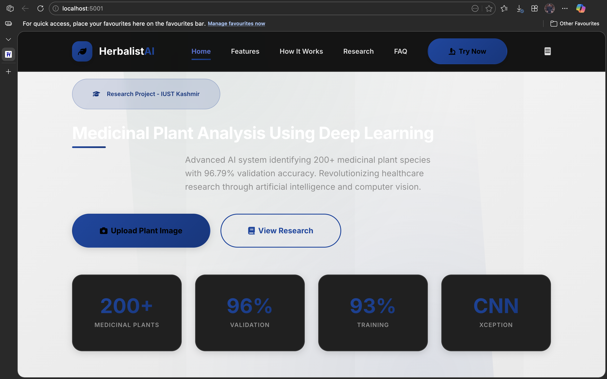
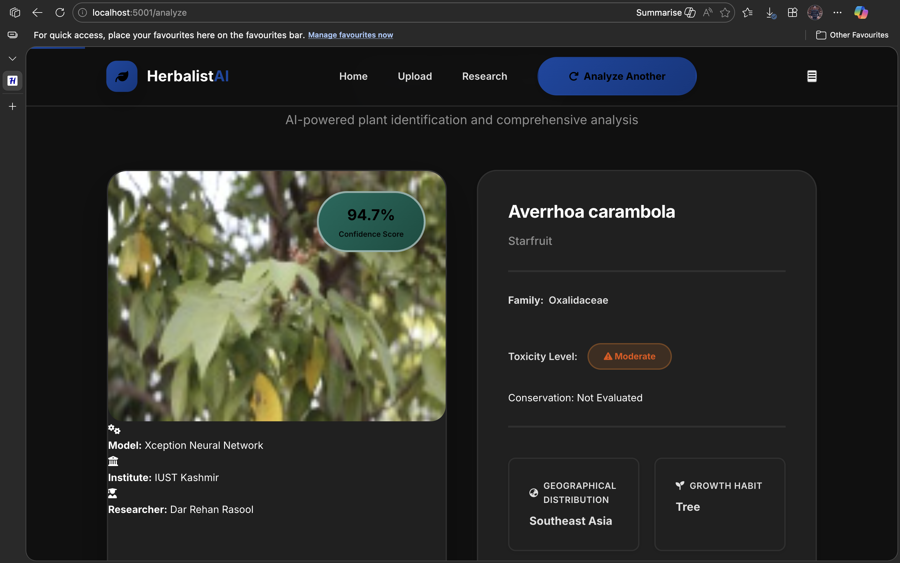

# Medicinal Plant Analysis using Deep Learning

[](https://www.python.org/)
[](https://flask.palletsprojects.com/)
[](https://www.tensorflow.org/)
[](LICENSE)
[](https://github.com/darrehanrasool/Herbalist)
[](https://herbalist.onrender.com/)

> ⚠️ **Note regarding the Live Demo:**
> The live application is hosted on **Render's Free Tier**, which has strict memory limitations (RAM). Deep Learning models like the Xception architecture used here requires significant memory.
>
> If the live demo fails to process an image or times out, it is likely due to the **server running out of memory**, not a bug in the code. For a smooth, stable experience, please **run the application locally** or deploy it to a cloud environment with at least 2GB of RAM.

## 📖 Overview

**Herbalist** is an advanced open-source research project designed to bridge the gap between botany and artificial intelligence. Utilizing a custom-tuned **Xception CNN architecture**, this tool identifies over **200+ medicinal plant species** with high precision.

Beyond simple identification, HerbalistAI acts as a digital botanist, providing immediate insights into pharmacological properties, toxicity levels, and active chemical compounds, helping researchers and students digitize nature.

## 🚀 Key Features

- **🔍 High-Accuracy Identification:** Achieved **96.79% validation accuracy** using Transfer Learning (Xception).
- **⚡ Real-Time Analysis:** Instant processing of raw plant images via a Flask web interface.
- **🧪 Detailed Pharmacological Reports:** Automatically extracts medicinal values, active compounds (e.g., Aloin), and toxicity levels.
- **📄 PDF Report Generation:** One-click export of research-grade reports for documentation.
- **📱 Responsive UI:** Clean, modern interface built for easy drag-and-drop interaction.

## 🛠️ Technology Stack

- **Deep Learning:** TensorFlow, Keras, Xception Architecture (Separable Convolutions)
- **Backend:** Python, Flask
- **Image Processing:** OpenCV, PIL
- **Data Handling:** Pandas, NumPy
- **Frontend:** HTML5, CSS3, JavaScript

## 📊 Model Performance

We trained the model on a curated dataset of medicinal plants, employing data augmentation techniques to ensure robustness in real-world scenarios.

| Metric                  | Score      |
| :---------------------- | :--------- |
| **Training Accuracy**   | 93.34%     |
| **Validation Accuracy** | **96.79%** |
| **Loss**                | < 0.2      |

## 📸 Screenshots

|                 Landing Page                 |                 Analysis Result                  |
| :------------------------------------------: | :----------------------------------------------: |
|  |  |

## ⚙️ Installation & Usage

1. **Clone the Repository**

   ```bash
   git clone [https://github.com/darrehanrasool/Herbalist.git](https://github.com/darrehanrasool/Herbalist.git)
   cd Herbalist
   ```

2. **Create a Virtual Environment**

   ```bash
   python -m venv venv
   source venv/bin/activate  # On Windows use `venv\Scripts\activate`
   ```

3. **Install Dependencies**

   ```bash
   pip install -r requirements.txt
   ```

4. **Run the Application**

   ```bash
   python app.py
   ```

5. **Access the Web Interface**
   Open your browser and navigate to `http://localhost:5001`

## 🤝 Contributing

Contributions are what make the open-source community such an amazing place to learn, inspire, and create. Any contributions you make are **greatly appreciated**.

1. Fork the Project
2. Create your Feature Branch (`git checkout -b feature/AmazingFeature`)
3. Commit your Changes (`git commit -m 'Add some AmazingFeature'`)
4. Push to the Branch (`git push origin feature/AmazingFeature`)
5. Open a Pull Request

## 👤 Author

### Dar Rehan Rasool

- Full Stack Architect & AI Researcher
- Computer Science Dept, IUST Kashmir
- [GitHub Profile](https://github.com/darrehanrasool)

---

- If you like this project, please give it a ⭐ on GitHub \*
